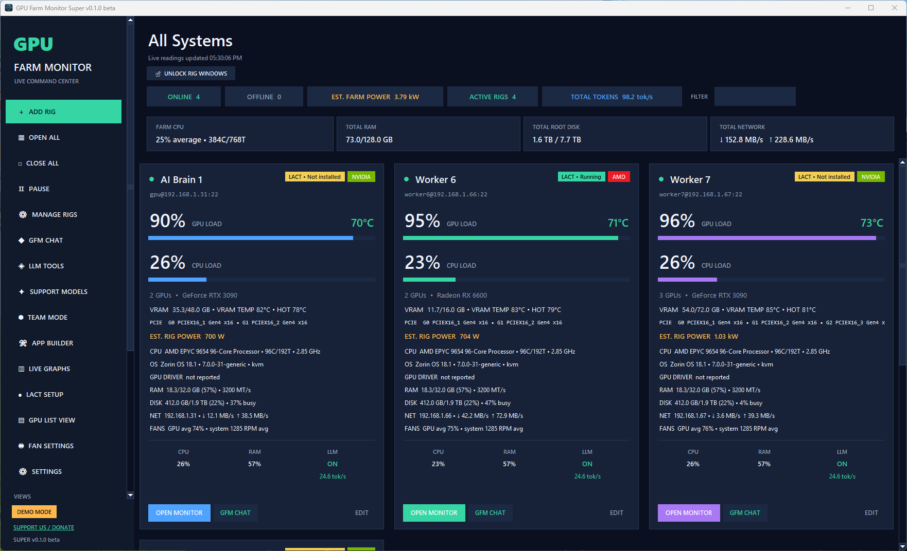
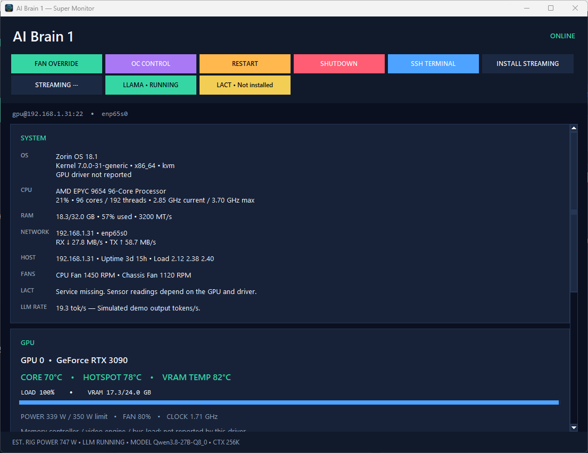
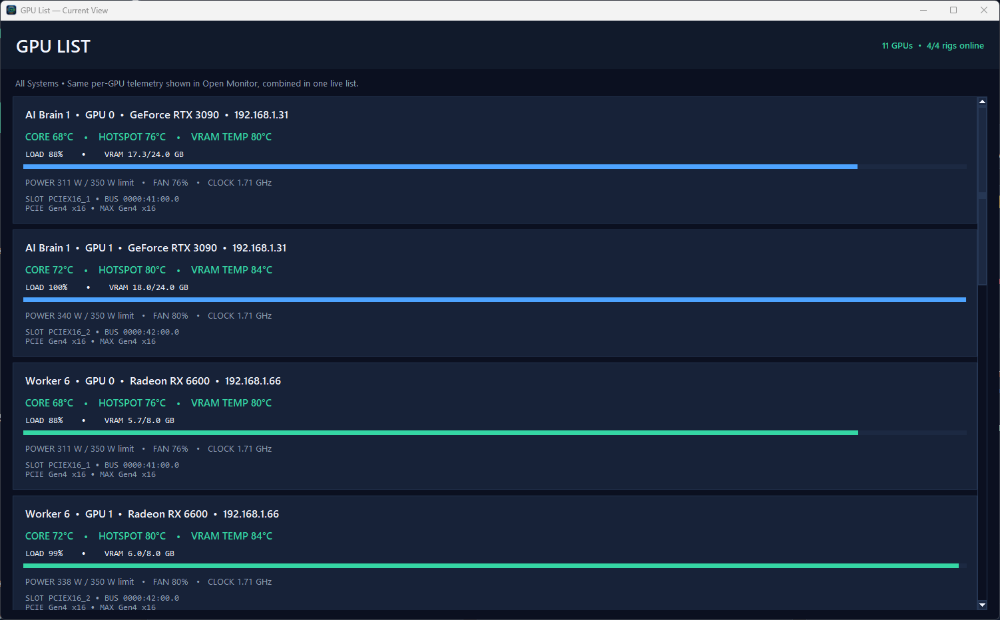
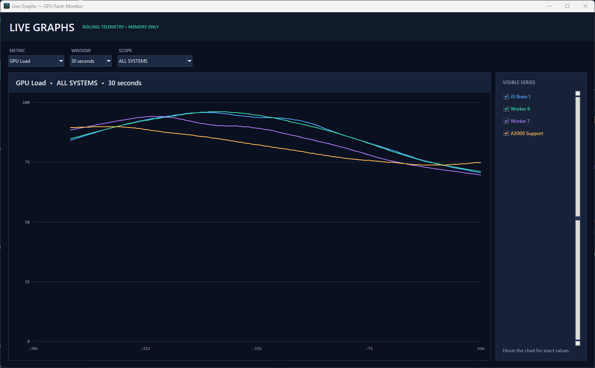
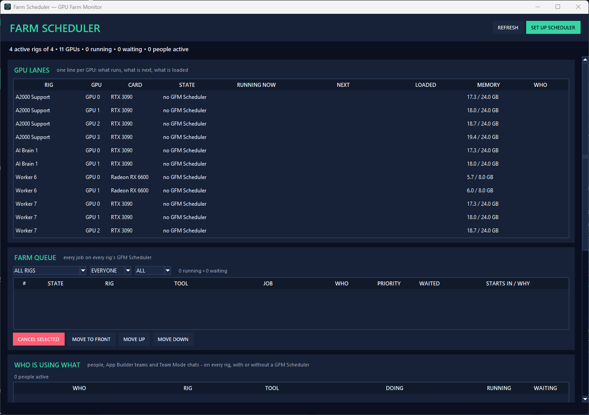
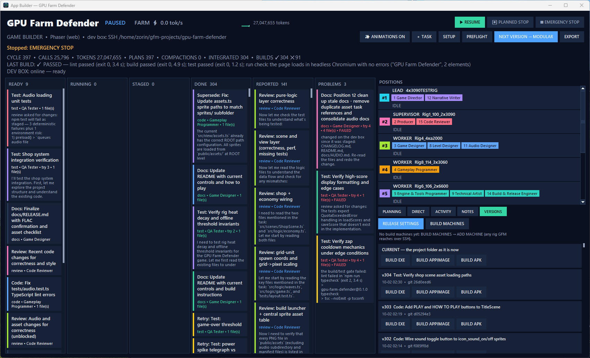
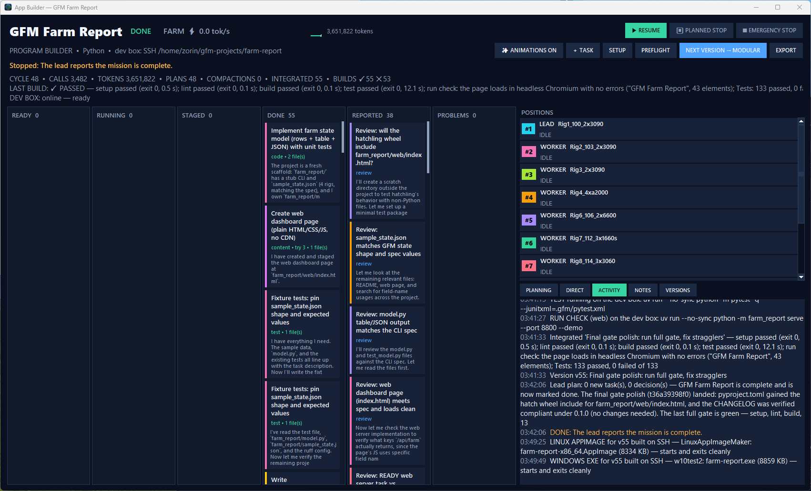
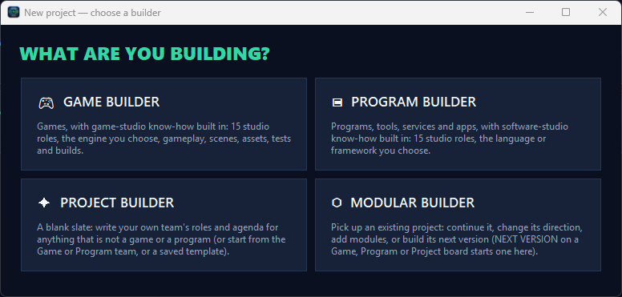
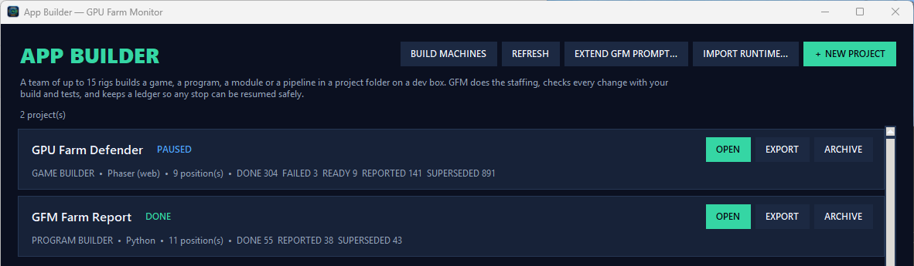

# GPU Farm Monitor

**One app to monitor, manage, control, stream, and run local AI across every GPU machine you own.**

Windows + Linux rigs · NVIDIA + AMD + Intel · Local-first · No telemetry · Free for personal, noncommercial use · 0.1.0 beta

**[Download GPU Farm Monitor for Windows](https://github.com/Crazykkid2000/GPU-Farm-Monitor/releases/download/v0.1.0-beta/GPU-Farm-Monitor-Setup-0.1.0-beta-x64.exe)** · [All downloads and release notes](https://github.com/Crazykkid2000/GPU-Farm-Monitor/releases/tag/v0.1.0-beta)

Windows 10 / 11 x64 · installer about 700 MB · not code-signed yet, so Windows may show a SmartScreen notice — see [Before you install](#before-you-install)

The main window in GPU Farm Classic, the default theme — demo mode (<code>--demo</code>) with simulated rigs

> **Beta software.** 0.1.0 beta is the first public release. Monitoring and rig management are the most mature
> parts of the app. **All LLM / AI features are in an early beta stage** — they run on the developer's own farm
> every day, but expect rough edges, and please report what you find.
>
> **Use hardware-control features carefully.** Fan curves, clocks, power limits, driver installs and restarts change
> real hardware: start small, keep an eye on temperatures, and keep backups.

GPU Farm Monitor (GFM) is a Windows app for GPU monitoring and remote GPU management, made for people who run more
than one GPU machine ("rigs"): homelabs, multi-GPU AI rigs, render nodes and ex-mining farms. Add a rig with its SSH
login and GFM shows live readings for every NVIDIA, AMD and Intel GPU in it, installs and updates drivers, sets fans,
clocks and power limits, streams the rig's desktop to your PC or your phone, and runs local AI models with llama.cpp
across the whole farm — chat, image / music / 3D generation, and teams of rigs that build software together. No agent
to install on the rigs, no cloud account, no telemetry.

| | |
|---|---|
| **Version** | 0.1.0 beta, 3 October 2026 (the app's window title reads GPU Farm Monitor Super 0.1.0 beta) |
| **Runs on** | Windows 10 / 11 x64. Phone: Android 8 or newer. Rigs: Linux or Windows. |
| **Price** | Free for personal, noncommercial use (see [Licence](#licence)) |
| **By** | crazykkid2000productions |

---

## Why GPU Farm Monitor

Running several GPU machines usually means a terminal per rig, a different tool for every vendor and a web page per
service. GFM puts the whole farm in one window on your PC — over plain SSH, Windows and Linux alike — and keeps it on
your own network.

- **See everything, live.** Every GPU's load, VRAM, core / hotspot / VRAM temperatures, power, fans and clocks, plus
  CPU, RAM, disks and network of every machine — NVIDIA, AMD and Intel, Linux and Windows, in one window.
- **Manage the farm from one place.** Driver installs and updates, fan curves, overclocks and power limits, SSH
  terminal, restart / shutdown, and Windows rig setup — on one rig or many at once.
- **Stream any rig's desktop.** Inside a GFM window on your PC, or on your phone with **one tap**: GFM sets up the
  streaming server on the rig, pairs your phone by itself and adds a virtual screen to rigs that have no monitor.
- **Your farm in your pocket.** The Android app and the web dashboard show the same live farm through your own GFM.
- **Run AI on hardware you already own (early beta).** Install and tune llama.cpp on every rig, download models from
  Hugging Face, chat with web search and image / music / 3D tools, pool several rigs into one big context, and let
  teams of rigs build games and programs.
- **Schedule AI work across your GPUs (early beta).** The farm scheduler keeps one queue per GPU for every AI job —
  chats first — with smart model swapping and task groups that spread pictures, music and 3D across your best GPUs.
- **Local-first.** No agent on the rigs, no cloud account and no telemetry; passwords and keys stay in Windows
  Credential Manager on your PC.

## Contents

- [Download](#download) · [Before you install](#before-you-install) · [Screenshots](#screenshots) ·
  [App Builder screenshots](#app-builder-ai-early-beta) · [Quick start](#quick-start)
- What it can do: [Monitoring](#monitoring) · [Rig management](#rig-management) ·
  [Streaming](#remote-desktop-streaming) · [AI / LLM](#ai--llm-features--early-beta) · [Scheduler](#scheduler) ·
  [Android and remote access](#remote-access-web-dashboard-desktop-client-and-android-app)
- [Requirements](#requirements) · [Security](#security-notes) / [Privacy](#privacy) · [Licence](#licence) ·
  [Known issues and troubleshooting](#known-issues-in-010-beta) · [Support](#support)

---

## Download

**New to GFM? Download the main installer — it is the only file you need to start.**

| Download | What it is | Size |
|---|---|---|
| **[GPU-Farm-Monitor-Setup-0.1.0-beta-x64.exe](https://github.com/Crazykkid2000/GPU-Farm-Monitor/releases/download/v0.1.0-beta/GPU-Farm-Monitor-Setup-0.1.0-beta-x64.exe)** | **Start here.** GPU Farm Monitor for Windows — the main app that watches and controls your rigs, with the optional desktop client. Per-user install, no admin rights needed. | 700 MB |
| [GPU-Farm-Monitor-Client-Setup-0.1.0-beta-x64.exe](https://github.com/Crazykkid2000/GPU-Farm-Monitor/releases/download/v0.1.0-beta/GPU-Farm-Monitor-Client-Setup-0.1.0-beta-x64.exe) | **Desktop client** — only for another Windows PC that views and controls your farm through your main GFM. | 167 MB |
| [GPU-Farm-Monitor-Client-0.1.0-beta-Android.apk](https://github.com/Crazykkid2000/GPU-Farm-Monitor/releases/download/v0.1.0-beta/GPU-Farm-Monitor-Client-0.1.0-beta-Android.apk) | **Android app** — monitor and control your farm from your phone, through your main GFM. | 41 KB |
| [GFM-Stream-12.2-gfm2-Android.apk](https://github.com/Crazykkid2000/GPU-Farm-Monitor/releases/download/v0.1.0-beta/GFM-Stream-12.2-gfm2-Android.apk) | **GFM Stream** — the companion app for one-tap streaming of a rig's desktop to your phone (a modified Moonlight for Android, GPL-3.0). | 11.1 MB |
| [GFM-Stream-12.2-gfm2-source.zip](https://github.com/Crazykkid2000/GPU-Farm-Monitor/releases/download/v0.1.0-beta/GFM-Stream-12.2-gfm2-source.zip) | The complete source code of GFM Stream (GPL-3.0). | 17.9 MB |
| [Sunshine 2025.924.154138](https://github.com/Crazykkid2000/GPU-Farm-Monitor/releases/download/v0.1.0-beta/Sunshine-2025.924.154138-complete-source.tar.xz), [Sunshine 2026.914.233613](https://github.com/Crazykkid2000/GPU-Farm-Monitor/releases/download/v0.1.0-beta/Sunshine-2026.914.233613-complete-source.tar.xz), [MoonlightSrc-6.1.0.tar.gz](https://github.com/Crazykkid2000/GPU-Farm-Monitor/releases/download/v0.1.0-beta/MoonlightSrc-6.1.0.tar.gz) | The complete source code of the open-source streaming programs GFM includes (Sunshine, GPL-3.0-only; Moonlight, GPL-3.0-or-later) — their projects' code, published here as their licence asks. GFM's own source code is not published. | 168 MB, 360 MB, 85.9 MB |
| `*.sha256` | A SHA-256 checksum for every download, on the [release page](https://github.com/Crazykkid2000/GPU-Farm-Monitor/releases/tag/v0.1.0-beta). | — |

The Android apps, GFM Stream's source and the desktop client are also on your own GFM's download page once its
server is on (Settings → Remote Server), so a phone or PC on your network can install them straight from your GFM.

### Before you install

- **No telemetry, no account.** GFM sends nothing about you or your farm to the developer — no analytics, no crash
  reports, no update check — and needs no cloud account (see [Privacy](#privacy)).
- **Your logins stay on your PC.** SSH passwords, API keys and tokens are stored in Windows Credential Manager on the
  computer running GFM, never in plain text.
- **Windows SmartScreen may show a notice — that is expected.** The installers are not code-signed yet, so the first
  time Windows may say "Windows protected your PC". Choose **More info → Run anyway**. Code-signed installers are
  planned for a later beta.
- **Check your download if you like.** Every file has a `.sha256` checksum on the release page. In PowerShell, run
  `Get-FileHash .\GPU-Farm-Monitor-Setup-0.1.0-beta-x64.exe -Algorithm SHA256` and compare the result with
  [GPU-Farm-Monitor-Setup-0.1.0-beta-x64.exe.sha256](https://github.com/Crazykkid2000/GPU-Farm-Monitor/releases/download/v0.1.0-beta/GPU-Farm-Monitor-Setup-0.1.0-beta-x64.exe.sha256).
- **This is the first public beta.** Expect bugs — especially in the AI / LLM features — and please report them
  (see [Support](#support)).

**Why is the installer about 700 MB?** Everything GFM needs comes inside it, so your PC needs no Python or Git: its
own Python runtime and libraries, the pinned Sunshine and Moonlight streaming packages (so GFM can set up streaming on
your rigs without fetching them), the desktop client, and the Android apps for your GFM's own download page.

---

## Screenshots

All screenshots show the released 0.1.0 beta in demo mode (`--demo`). The farm views use the demo's simulated rigs;
the App Builder boards are real projects that the developer's rigs built, opened in the same release.

<table>
  <tr>
    <td width="50%" valign="top"> <b>Rig monitor</b> — everything about one rig (OPEN MONITOR)</td>
    <td width="50%" valign="top"> <b>GPU list view</b> — every GPU in the farm in one list</td>
  </tr>
  <tr>
    <td width="50%" valign="top"> <b>Live graphs</b> — the farm, a view, a rig or one GPU over time</td>
    <td width="50%" valign="top"> <b>Farm scheduler</b> (AI, early beta) — one lane per GPU, the farm queue and who is using what</td>
  </tr>
</table>

### App Builder (AI, early beta)

<b>GAME BUILDER</b> — GPU Farm Defender, a Phaser web game built by a team of 9 rigs: 397 cycles, 304 tasks
integrated, each version listed with its git commit (VERSIONS tab). The project is paused.

<b>PROGRAM BUILDER</b> — GFM Farm Report, a Python tool built by a team of 11 rigs: the last build passed every
gate (133 tests passed), the lead marked the mission complete, and the Windows EXE and Linux AppImage were built on
the developer's build machines.

<table>
  <tr>
    <td width="50%" valign="top"> <b>New project</b> — Game, Program, Project or Modular builder</td>
    <td width="50%" valign="top"> <b>Projects</b> — every project with its builder, engine, team size and task counts</td>
  </tr>
</table>

---

## About this project

Development of GPU Farm Monitor started on **18 September 2026 at 5 PM**. Two weeks later it monitors, manages and
runs AI work across a real multi-rig farm of Linux and Windows machines every day — from single-GPU PCs up to
4 × RTX 3090 rigs running 120-billion-parameter models. That pace is the plan: updates and fixes come quickly, and
every release says exactly what changed.

---

## Quick start

1. Run the installer and start **GPU Farm Monitor**.
2. Click **ADD RIG**: name, IP address, SSH user and password or key. **TEST CONNECTION**, then **SAVE RIG**.
   - Linux rigs: any Ubuntu / Debian / Fedora-family machine with SSH.
   - Windows rigs without SSH: turn on GFM's server (Settings → Remote Server), open its web page on that PC and
     use **INSTALL SSH ON THIS WINDOWS PC** (see [Windows rigs](#windows-rigs)).
3. The rig's window appears with live readings. **OPEN MONITOR** shows everything about it.
4. **On your phone (optional):** turn on GFM's server (Settings → Remote Server). On the phone, install the GFM
   Android app and GFM Stream (from this page, or from your GFM's own download page), open the GFM app and enter your
   GFM PC's address, for example `192.168.1.50:9654`. The phone must be on the same network.
5. Optional next steps: **LACT SETUP** for fan curves and overclocking on Linux, **INSTALL STREAMING** for the remote
   desktop, **INSTALL / UPDATE LLAMA.CPP** to start running AI models.

---

## What it can do

### Monitoring
- **Every GPU, live:** load, VRAM used / total, core temperature, **hotspot and VRAM temperatures** (shown on their
  own, never guessed from the core), power draw, fan % / RPM and clocks.
- **The whole machine:** CPU load and clock, RAM (and DIMM speed), every disk (space, busy %, read / write MB/s),
  network (IP, live up / down), OS, kernel, uptime, load averages and SSH latency.
- **Hardware details:** PCIe slot and bus address, current / maximum link generation and width, GPU driver version,
  CPU / chassis / pump fan speeds where the hardware reports them.
- **Extra Windows sensors** (memory clock, core voltage, memory-controller and video-engine load, PCIe traffic,
  package power) through GFM's sensor reader, with live min / max.
- **NVIDIA, AMD and Intel GPUs** — NVIDIA through the driver, AMD through Linux sysfs (no ROCm needed), Intel with
  fewer readings. Multi-GPU and mixed-vendor rigs are fine. A GPU without a driver is still named from its PCI ID.
- **CPU MODE:** machines without a GPU (CPU services, rerankers, document converters) show as healthy CPU workers,
  not as errors.
- **Farm overview:** ONLINE / OFFLINE, estimated farm power, ACTIVE RIGS and total AI tokens per second at the top;
  **GPU LIST VIEW** shows every GPU in one list; **OPEN ALL** opens a detailed monitor for every rig.
- **LIVE GRAPHS** for the farm, a view, a rig or one GPU, over 30 s – 15 min: GPU load / temperatures / VRAM / power /
  fan / clock, CPU, RAM, disk, network, power and AI tokens/s. Hover for exact values.
- **Views:** your own groups of rigs (ALL SYSTEMS plus custom views); totals and actions follow the view you pick.
  Rig windows can be dragged into the order you like, saved per user.
- **Power estimate** per rig and for the farm (GPU board power plus an overhead you set).
- **Fast and light:** rigs are read in parallel over SSH, with the connection kept open between readings; you set the
  refresh interval (1–300 s). Hot readings turn amber / red, offline rigs turn red.
- **No telemetry:** graph history lives in memory only, and GFM sends nothing about you or your farm to the developer
  (see [Privacy](#privacy)).

### Rig management
- **Add, edit, test, disable and remove rigs**; **MANAGE RIGS** shows every rig's OS, GPUs and drivers and runs
  actions on many rigs at once.
- **Secure by default:** SSH passwords, API keys and tokens are stored in **Windows Credential Manager**, never in
  plain text. SSH host keys are pinned on first connect; a changed key is refused until you approve it.
- **GPU drivers:** **CHECK DRIVERS ONLINE** and **INSTALL / UPDATE DRIVERS** — official NVIDIA / AMD / Intel packages
  on Windows (signature checked), signed distro packages on Linux; live progress per rig (file, MB/s, ETA) and a full
  log. Packages are downloaded once and reused for every rig. **UNINSTALL DRIVERS (CLEAN)** on Windows.
  GFM never reboots a rig by itself — it tells you when a reboot is needed.
- **Fans, overclocking and power limits:**
  - **FAN OVERRIDE** — fixed % or AUTO, per GPU or many at once; a **CUSTOM FAN CURVE** editor.
  - **FAN SETTINGS** — one speed or curve for every GPU in a view.
  - **OC CONTROL** — core, memory and power-limit sliders across several GPUs, with live readings, APPLY / RESET.
  - **GPU POWER LIMIT** with **KEEP AFTER REBOOT**.
  - Linux uses **LACT** (GFM installs it for you with **LACT SETUP**); Windows uses NVIDIA clock offsets.
- **SSH TERMINAL**, **RESTART** and **SHUTDOWN** (with confirmations).
- **llama.cpp on your rigs:** **INSTALL / UPDATE LLAMA.CPP** (built for CUDA, Vulkan or CPU on Linux; official builds on
  Windows), **START / STOP**, **UNINSTALL** (your models are kept unless you tick them), and **CONVERT TO GFM FORMAT** to
  move a hand-built llama.cpp setup onto GFM's managed service — it measures speed before and after and rolls back by
  itself if it got slower.
- **Backups:** EXPORT / IMPORT BACKUP of rigs, views and settings (passwords only if you opt in, protected by a
  passphrase).

#### Windows rigs
- **INSTALL SSH ON THIS WINDOWS PC** — a small installer that sets up OpenSSH, start-with-Windows and a local-network
  firewall rule (keep current settings, or a clean install with a backup). If Windows cannot add its own OpenSSH
  Server, it installs Microsoft's signed OpenSSH package instead.
- **INSTALL WINDOWS SENSORS** / **INSTALL FAN / OC SUPPORT** — GFM's sensor reader (built on LibreHardwareMonitor)
  runs at boot.
- **SERVER LIGHT** — strips consumer apps, ads and telemetry and sets a never-sleep power plan (restore point first;
  **EXIT SERVER MODE** to undo).
- **WINDOWS UPDATE ON / OFF**, **AUTO DRIVER UPDATES** with the GPU driver locked so Windows Update can't replace it,
  and an **ADMIN POWERSHELL** terminal.

### Remote desktop streaming
Watch and control any rig's desktop — on your GFM PC or on your phone.

- **INSTALL STREAMING** puts a pinned, checksum-verified **Sunshine** streaming server on the rig and pairs GFM
  automatically — nothing to type. **REPAIR STREAMING** fixes a broken setup, **UNINSTALL STREAMING** removes it.
- **STREAM DESKTOP on your PC** shows the rig's desktop inside a GFM window (powered by Moonlight): resolution / FPS /
  bitrate / codec chips, **FULLSCREEN**, **KEYS**, **LOCK**, **END SESSION**; all Moonlight hotkeys work.
- **STREAM DESKTOP on your phone — one tap.** In the GFM Android app, tap **▶ STREAM DESKTOP** on a rig: GFM gets the
  rig ready, switches its screen on and opens **GFM Stream** straight onto the rig's desktop. The first time, GFM Stream
  pairs itself with the rig — no PIN to type. Pairing attempts that were left hanging are cleared automatically, and
  **↻ FIX PAIRING** restarts the rig's streaming server if a pairing ever gets stuck. Without GFM Stream installed,
  the button opens the official Moonlight app instead.
- **Rigs with no monitor plugged in** get a virtual screen:
  - **Windows:** the Parsec Virtual Display Driver (you choose it at install; GFM downloads Parsec's signed installer).
    The virtual monitor exists only while you stream.
  - **Linux:** a virtual 1920×1080 screen is added automatically when no monitor is connected. It needs **one reboot**
    after the first install — Rig Management shows **REBOOT RIG NOW** for it — and never again.
- Supported rigs: Windows 10 / 11, Ubuntu 22.04 / 24.04 and derivatives (Zorin, Mint, Pop!_OS), Debian 13.

### Remote access, web dashboard, desktop client and Android app
- An optional **built-in server** (port **9654**, off by default, sign-in required) lets your other devices use your
  farm: GFM reads the rigs once and every viewer shares the same live state, so extra viewers add no load on the rigs.
- **Web dashboard** for phones, tablets and other PCs: rig cards, graphs, views, admin controls, drivers and the farm
  scheduler.
- **Desktop client** for another Windows PC: the full GFM interface, with every action going through your main GFM.
- **Android app** (Android 8+): remembers your GFM server and opens the full touch dashboard — rig cards, graphs,
  controls, GFM Chat, App Builder and streaming management. **▶ STREAM DESKTOP** opens the rig in GFM Stream with one
  tap. Files you download are saved to the phone. It keeps you signed in, the phone's Back button closes the open
  page or menu, and if your GFM cannot be reached it tells you why within 15 seconds (RETRY / CHANGE SERVER). Tested on
  a real phone (Galaxy Note 9, Android 10).
- **GFM Stream** (Android 5+): GFM's companion streaming app, a modified Moonlight for Android under the GPL-3.0. It
  installs next to the official Moonlight without replacing it, and its full source code is published with every
  release.
- **Accounts:** ADMIN and USER roles, per-user AI on / off and tool permissions, session control and an audit log of
  admin actions. Passwords are salted and hashed; logins are rate-limited. Sign-ins last 8 hours and survive a GFM
  restart or update, saved encrypted (AES-256, key in Windows Credential Manager; only a fingerprint of each sign-in is
  stored).
- **OpenAI-compatible endpoint** on each rig (stable URL and key through GFM's gateway) for tools like Open WebUI.
- A versioned **Remote API** for scripts.

### Looks
- **8 themes:** GPU Farm Classic, Midnight OLED, Graphite, Cyber, Light, Neon Reactor, **Neon Fusion** and **Neon Fusion
  Overdrive** — a moving neon backdrop rendered once on your GFM PC (GPU or CPU) and shared with every client, glass rig
  windows and a light that runs round the active window.
- Effect quality AUTO / HIGH / MEDIUM / LOW (respects Windows' reduced-motion setting), **UI SIZE** for TVs and high-DPI
  screens.
- The **LLM FUNCTIONS** switch hides every AI feature for users who only want monitoring.

### AI / LLM features — early beta

> Everything in this section is **early beta**. It is used daily on the developer's farm, but it is new, it changes
> fast, and it is the part most likely to surprise you.

**Running models on your rigs**
- **LLAMA • SETTINGS** — every llama.cpp option in plain fields (context, slots, KV cache, flash attention, GPU layers,
  layer / tensor split, threads, reasoning and more); only what you changed is written, with a backup.
- **OPTIMIZED DEFAULTS** — reads the model and your GPUs and sizes llama.cpp for the whole card at the largest context
  that fits; shows old → new before writing. **TUNE** test-loads each size until one really answers.
- **SPEED BOOK** — GFM measures each hardware + model + split combination (one request and four at once) and uses the
  winner.
- **AI TUNER** — a model on one rig tunes another rig's launch options, testing each set safely and keeping the best.
- **HUGGING FACE browser** — search GGUF models, pick a quantization by size, download to a rig or once into GFM's
  **MODEL CACHE** and deploy to many rigs; resume, cancel, gated models with your token; vision projectors included.
- **LOAD / UNLOAD / swap models** without restarting the service; each load is checked with a real test answer.

**GFM Chat**
- Chat with any model on any rig: live answer and thinking, Markdown, tables, charts, inline pictures and a built-in
  song player.
- Attach PDFs, Word files, code, images and 3D models; context bars show how full the model's memory is.
- **Tools:** web search (SearXNG), **image generation and editing, music and 3D models** (ComfyUI and others), a Python
  sandbox, SSH tools on your rigs (off by default, read-only or full), any OpenAPI service.
- **VALVES** presets (QUICK ANSWER, RESEARCH, BIG BUILD), **CONTINUE**, **LOOP GUARD**, per-user **MEMORY** (never keeps
  passwords or keys), chat search, auto titles, follow-up suggestions, **COMPACT** for long chats, and EXPORT / IMPORT
  (GFM or Open WebUI format).
- **Parallel conversations** — a second person can ask to share a busy model without restarting it.
- **TEAM MODE** — 2–10 rigs and a lead pool their memory to work through far more material than one model can hold.

**Generation services and the farm scheduler**
- **DEPLOY SERVICES** installs and runs SearXNG, ComfyUI (image / edit), music, 3D, a Python sandbox, a GLB → STL / 3MF
  converter and the GFM Scheduler on your rigs, with progress, **PIN TO GPU** and on-demand loading.
- **TOOL SETTINGS** — choose a workflow or install a ComfyUI template sized for your GPU (6 GB to 24 GB tiers, each
  model's licence shown before download), and set quality, picture size, song length and mesh detail; a progress bar
  shows generation live.
- **MASTER SCHEDULER / FARM SCHEDULER** — one queue per GPU for every AI job (chats first), smart model swapping,
  **TASK GROUPS** that spread pictures, music and 3D across your best GPUs, **QUICK LOAD** to keep models ready in RAM,
  and **GENERATION BURST** profiles.

**APP BUILDER**
- Give a team of your rigs a mission and they build it: **GAME BUILDER**, **PROGRAM BUILDER**, **PROJECT BUILDER** (your
  own roles) and **MODULAR** (continue an existing project).
- A lead, workers, reviewers and a supervisor work a live task board on a dev box (another machine over SSH, or a
  folder on your PC). Models never get a raw shell — GFM writes their files and runs your build commands.
- **DETECT FROM PROJECT** recognises Unity, Godot, Python, Node / TypeScript, Rust, Go, .NET, CMake, Gradle, Flutter,
  Electron and web projects.
- A **build / test gate** (lint, build, test, run check) decides when a task is really done; git commits follow.
- **PLANNING** (brainstorm → plan → approve), **DIRECT** notes to the team, **EMERGENCY / PLANNED STOP** and **RESUME**.
- **VERSIONS → BUILD EXE / APPIMAGE / APK** on your own build machines.

**More**
- **SUPPORT MODELS** (task model, context compactor, document conversion, embeddings, reranker) and **GFM's own small
  model** on your PC.
- **LONG-CONTEXT BENCH** — compare one rig with Team Mode on long material.
- **DISK GUARD** — refuses downloads that would fill a drive.

### Everything else
- System-tray app, one instance at a time, **DEMO MODE** with simulated rigs (`--demo`), `--self-test`.
- Updates keep your rigs, views, settings, credentials, accounts and chats. Uninstalling keeps your data unless you
  choose to remove it.
- A diagnostic log with passwords, keys and tokens hidden.

---

## Requirements

**The GFM PC:** Windows 10 (1809 or newer) or Windows 11, x64. Everything it needs is in the installer (no Python or
Git). A graphics card is optional (the Neon Fusion themes use one if present).

**Rigs:**
- **Linux:** Ubuntu, Debian, Zorin, Mint, Pop!_OS, Fedora and similar, with SSH. Python 3 and `sudo` for management
  features; systemd for llama.cpp and LACT. Streaming needs the rig to start a desktop session (most desktop installs
  do).
- **Windows 10 / 11:** OpenSSH (GFM can install it). The Windows Python sandbox needs Docker Desktop with WSL 2.

**Phone:** the GFM Android app needs Android 8 or newer; GFM Stream runs on Android 5 or newer.

**Network:** monitoring and control work on your local network only. The internet is used only when you ask for it:
drivers, llama.cpp, models from Hugging Face, LACT, the Parsec virtual display, ComfyUI templates, web search.

| Port | Used for |
|---|---|
| 22 | SSH to your rigs |
| 9654 | GFM's optional server (web dashboard, desktop client, Android app) — off by default |
| 47984–47990 TCP, 47998–48010 UDP | Sunshine streaming on a rig (your PC and phone must reach these) |
| 8080 | llama.cpp on a rig (through GFM's gateway) |
| 8190 / 8188 / 3001 | GFM Scheduler / ComfyUI / SearXNG on a rig, when you deploy them |

---

## Security notes
- GFM's server speaks plain **HTTP for your trusted local network**. Do not expose port 9654 to the internet; put your
  own HTTPS reverse proxy in front if you need access from outside.
- Rig SSH tools for AI models are **off** until you turn them on per rig; models never see your passwords.
- Fan, clock, power-limit, driver and Windows-tuning features change real hardware and system settings when you ask
  them to. Start small and keep an eye on temperatures.

## Known issues in 0.1.0 beta
- Installers are not code-signed yet (SmartScreen warning on first run).
- Opening a very large APP BUILDER board takes a few seconds while Windows draws it.
- Windows 11 25H2: rare SSH stalls on very large scripts (GFM sends big scripts as files to avoid it).
- Vision-model projector pairing on Windows is a best guess for generically named projector files; a wrong pair is
  undone automatically.
- A rig's tokens/s shows **"needs API key"** until you add that rig's llama.cpp API key (EDIT RIG).
- Streaming: each GFM PC keeps the streaming login of the rigs it set up. If streaming on a rig was installed by a
  different GFM, run **REPAIR STREAMING** on that rig once.
- A Linux rig that is set to boot without a desktop (text mode only) cannot stream until its desktop is turned on.
- GFM Stream still uses Moonlight's app icon.
- Desktop client: Neon Fusion is not smooth in the client and can make it feel sluggish (the client paints the theme
  inside its own window process). GPU Farm Classic, the default theme, is smooth. A smooth Neon Fusion client is
  coming in the next update.
- No e-mail / push alerts yet — problems show as colours in the app.
- The Android apps are installed from APK files (not Google Play yet): Android asks you to allow installing apps from
  your browser or file manager the first time.
- Coming in later betas: Linux app (AppImage), code-signed installers, Google Play.

---

## Licence
GPU Farm Monitor is **free for personal, noncommercial use** under the **GPU Farm Monitor Software License Agreement**
— `LICENSE.txt`, shown by the installer (you accept it there) and installed with the app. It is not open source.

- Use it on your own computers and on rigs you are allowed to manage.
- To share GFM, share the link to this GitHub release page — please don't pass the installer file around.
- Commercial use needs a separate licence: contact crazykkid2000productions@gmail.com.
- It comes with **no warranty**, and the developer's liability is limited. The agreement is the full and binding text.

You can keep using this 0.1.0 beta free of charge for personal, noncommercial use. Later updates may be offered on
different terms and may cost money; that never takes away your right to keep using a version you already have.

Copyright © 2026 Vincent Fries, developed as crazykkid2000productions.

The open-source programs that come with GFM keep their own licences, and GFM's licence takes none of those rights away
(see [Credits](#credits)).

**GFM Stream is different:** it is a modified version of Moonlight for Android and is licensed under the **GNU General
Public License v3.0**. You may copy, change and share it under that licence; its complete source code
(`GFM-Stream-12.2-gfm2-source.zip`) is published next to the APK.

## Privacy
GFM is local-first. The full policy is `PRIVACY.md` (in this repository and installed with the app); in short:

- **Nothing goes to the developer.** No telemetry, no analytics, no crash reports, no update check, no account.
- **Your data stays on your computers.** Rig settings, chats, prompts, uploaded files, memory and logs are kept in
  files on the computer running GFM (the host). Passwords and keys are kept in Windows Credential Manager, and the log
  hides passwords, keys and tokens.
- **Shared hosts:** if you let other people sign in to your GFM, you are their host administrator. You can see their
  accounts, sign-in sessions (device address and times), the audit log and job queues, and anyone with access to the
  host computer's files can read what GFM stores.
- **Internet use happens when you ask for it:** downloads (drivers, llama.cpp, models, Docker images and more) come
  straight from their publishers, and GFM Chat's web search sends search queries through SearXNG on your own computer
  to public search engines.
- **The built-in server is plain HTTP.** Use it on a trusted local network, or put your own HTTPS proxy or VPN in
  front of it. Streaming goes directly between your own devices.

## Credits
**GPU Farm Monitor by crazykkid2000productions.**

GPU Farm Monitor stands on the work of many open-source projects — thank you to all of them. Built with Python,
Tcl/Tk and PyInstaller and the Python libraries Paramiko, cryptography, keyring, Pillow, pystray, pypdf, jsonschema,
truststore, miniaudio and ModernGL, plus xterm.js in the web dashboard. Streaming uses **Sunshine** (LizardByte) and
**Moonlight** (the Moonlight Game Streaming Project); **GFM Stream** is built on Moonlight for Android. GFM can also
install llama.cpp, LACT, LibreHardwareMonitor, the Parsec Virtual Display Driver, ComfyUI, SearXNG and more, and names
driverless GPUs with the PCI ID Repository's list.

Every component, its version, licence and source is listed in `THIRD_PARTY_NOTICES.md`, and the full licence texts
ship in the app's `licenses` folder. AI models you download have their own licences.

## Support
Bug reports, questions and feature requests: **crazykkid2000productions@gmail.com** — or open an issue on this
repository. Please include your GFM version (Settings → ABOUT) and what you were doing.
